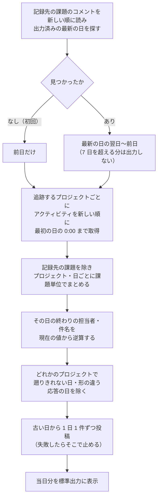

# backlog_change_log

Backlog のプロジェクトで **どの課題が作成・更新・削除されたか** を、1 日ごとに特定の課題のコメントへ記録する CLI ツール。
複数のプロジェクトを 1 つの課題にまとめて記録できます。

毎日実行すると、前日の変更が 1 件のコメントとして記録先の課題に残ります。
実行を忘れた日があっても、次に実行したときに 1 日ずつ補います。

## 主要機能

- **1 日 1 件のコメント** : 前日までの変更を、JST の 0:00〜24:00 ごとに 1 件のコメントとして投稿する
- **複数のプロジェクト** : 追跡するプロジェクトを並べると、1 件のコメントの中でプロジェクトごとに見出しを分ける
- **変わった項目と、その日の終わりの担当者** : 課題ごとに 1 行。誰が何から何に変えたかは載せない
- **実行忘れを補う** : 出力済みの最新の日の翌日から前日までを、1 日ずつ投稿する（最大 7 日）
- **当日分は表示だけ** : 当日の変更は標準出力に出し、コメントには書かない
- **事故防止** : 投稿は再送しない、同時実行はロックで防ぐ、欠けた日は投稿しない
- **診断** : 実際のスペースの応答が前提どおりかを、読み取りだけで確かめられる
- **対話メニュー** : CLI オプションを覚えなくても、番号を選ぶだけで実行できる

---

## 目次

**入門**
1. [クイックスタート](#クイックスタート)
2. [動作要件](#動作要件)

**使い方ガイド**
3. [メニューから実行する](#1-メニューから実行する)
4. [まず応答を確かめる](#2-まず応答を確かめる)
5. [記録する](#3-記録する)
6. [出力される日](#4-出力される日)
7. [記録先の課題](#5-記録先の課題)
8. [複数のプロジェクトを追跡する](#6-複数のプロジェクトを追跡する)
9. [実行例](docs/EXAMPLES.md)

**リファレンス**
10. [コメントの形式](#コメントの形式)
11. [設定ファイル](#設定ファイル)
12. [CLI オプション一覧](#cli-オプション一覧)
13. [エラー時のリトライ](#エラー時のリトライ)
14. [Exit code](#exit-code)
15. [既知の制約](#既知の制約)
16. [ファイル構成](#ファイル構成)

**開発者向け**
17. [設計方針](#設計方針)
18. [テスト](#テスト)
19. [変更履歴](#変更履歴)
20. [ライセンス](#ライセンス)

---

## クイックスタート

**メニューから使う** （CLI オプションを覚えなくてよい）:

```cmd
:: Windows: menu.bat をダブルクリック、またはコマンドから
cd C:/path/to/backlog_change_log
menu.bat
```

```bash
# macOS / Linux
cd /path/to/backlog_change_log
.venv/bin/python menu.py
```

**CLI から使う** :

```bash
# 1. 依存を入れる
python3 -m venv .venv
.venv/bin/pip install pyyaml

# 2. 接続情報と記録先の課題を設定する
cp config.example.yaml config.yaml

# 3. 応答が前提どおりかを確かめる（読み取りだけ）
.venv/bin/python check_api.py

# 4. 投稿される内容を確かめる（投稿しない）
.venv/bin/python backlog_change_log.py --dry-run

# 5. 問題なければ投稿する
.venv/bin/python backlog_change_log.py
```

`config.yaml` に書くのは、接続情報と記録先の課題、追跡するプロジェクトだけです。

```yaml
backlog:
  space_host: "myteam.backlog.com"
  api_key: "YOUR_API_KEY_HERE"
target:
  issue_key: "PROJ-1"
  project_keys: [PROJ, SUPPORT]   # 省略すると記録先の課題のプロジェクトだけ
```

---

## 動作要件

- **Python 3.10 以上** （`str | None` 形式の型注釈を使用）
- 依存は **PyYAML のみ**

足りない場合は、起動時に何が足りないかを表示して Exit code `2` で終了します。
macOS 標準の `/usr/bin/python3`（3.9）では動きません。

`config.yaml` は API キーを含むため `.gitignore` で除外されています（`.env` も同じ）。

---

## 使い方ガイド

### 1. メニューから実行する

CLI オプションを覚えなくても、番号を選ぶだけで実行できます。

```bash
.venv/bin/python menu.py
```

```

============================================================
  Backlog 変更記録
============================================================
  接続先    : myteam.backlog.com
  記録先    : PROJ-1
  追跡      : PROJ, SUPPORT
  API キー  : 設定済み

============================================================
  操作を選択
============================================================
  1. 投稿内容を確認する ― 投稿するコメントを表示するだけ（投稿しません）
  2. 記録する ― 前日までの未出力の日を、記録先の課題にコメントとして投稿する
  3. API の応答を確かめる ― 応答が本ツールの前提どおりかを確かめる（読み取りだけ）
------------------------------------------------------------
  0. 終了
============================================================
```

- 見出しに、設定ファイルから読んだ接続先・記録先・追跡するプロジェクトと、API キーが見つかるかを出します
  （キーの値は出しません）。足りないものは「※」で示します
- **「記録する」は、実行の前に 1 回確認します** （`y` 以外はすべて取りやめ）。本体には確認が無いためです
- 前回の選択を既定にします（Enter だけで選べる）。ただし **「記録する」は既定にしません。**
  Enter を続けて押しただけで投稿の確認まで進まないためです
- 「API の応答を確かめる」では、遡る日数（7 / 30 / 90 日）を選びます
- 実行後に終了コードとその意味を表示します
- 前回の選択は `~/.backlog_change_log_menu.json` に保存します（壊れていても既定値で続行します）
- 設定ファイルを指定するときは `--config` を付けます（`.venv/bin/python menu.py --config other.yaml`）

**無人実行（定期実行）にはメニューではなく、`backlog_change_log.py` を直接使ってください。**

### 2. まず応答を確かめる

初めて使うスペースでは、先に `check_api.py` を実行します。
**読み取りだけで、投稿はしません。** 課題の件名やコメントの本文は表示せず、項目名と件数だけを表示します。

```bash
.venv/bin/python check_api.py
```

本ツールは、Backlog のアクティビティの応答について次のことを前提にしています。
公開されている API の仕様に基づくもので、スペースごとの応答はテストでは確かめられません。

- 担当者の変更が、変わった項目名 `assigner` として返る
- コメントの本文が `content.comment.content` に入る
- 一括更新が `content.link[]` と `content.changes[]` を持つ
- 作成・更新・コメント・削除が、課題の ID・番号・件名を持つ

期間内に担当者の変更や一括更新が無いと、その前提は「確かめられていない」と表示されます。
`--days 30` のように期間を延ばして再実行してください。前提と違う応答があれば Exit code `1` を返します。

### 3. 記録する

まず `--dry-run` で、投稿される内容を確かめます。

```bash
.venv/bin/python backlog_change_log.py --dry-run
```

問題なければ投稿します。

```bash
.venv/bin/python backlog_change_log.py
```

前日までの分は記録先の課題へ投稿し、当日の変更は標準出力に表示します。
定期実行（launchd / cron など）の設定は、このツールの範囲外です。
定期実行するときは、Exit code が `0` 以外のときに気付けるようにしてください（[Exit code](#exit-code)）。

### 4. 出力される日

| 状況 | 出力する日 |
| --- | --- |
| 初回（記録先にまだ記録が無い） | 前日だけ |
| 2 回目から | 出力済みの最新の日の翌日〜前日 |
| 上の期間が 7 日を超える | 前日から遡った直近 7 日だけ。それより古い日は出力しない |

**初回は前日だけです。** 過去に遡って大量のコメントを投稿しないためです。
**途中で抜けた日は補いません。** 出力済みの最新の日より前は見ません。

古い日から 1 日ずつ投稿し、失敗したらそこで止めます。残りの日は次回の実行で出力します。

次の日は投稿せず、警告を出して Exit code `3` を返します。

- 7 日の上限を超えた日（次の実行でも出力しない）
- アクティビティを遡りきれず、変更が揃っているか分からない日
- 想定と違う形のアクティビティがあった日

### 5. 記録先の課題

出力済みかどうかは、記録先の課題のコメント末尾にある `対象日: YYYY-MM-DD` の行で判定します。
判定の対象は **API キーの持ち主が投稿したコメント** だけです。

> [!WARNING]
> `対象日:` の行は手で書き換えたり消したりしないでください。消すとその日が未出力として扱われ、
> 書き換えると別の日が出力済みとして扱われます。

- コメントの記法（マークダウン / Backlog 記法）は、記録先の課題のプロジェクトの設定に合わせます
- **記録先の課題そのものの変更は、記録の対象から外します** （自分の投稿が毎日「更新」に載るため）
- API キーを別の人のものに替えると、それまでの記録は自分の投稿と見なされず、初回の扱いに戻ります

### 6. 複数のプロジェクトを追跡する

`target.project_keys` に追跡するプロジェクトを並べます。

```yaml
target:
  issue_key: "PROJ-1"
  project_keys: [PROJ, SUPPORT, INFRA]
```

- **1 日 1 件のコメント** の中で、プロジェクトごとに見出しを分けます（[コメントの形式](#コメントの形式)）
- **記録先の課題のプロジェクトも、一覧に書いたときだけ追跡します。** 一覧を省略したときは、
  記録先の課題のプロジェクトだけを追跡します（1 つだけのときと同じ動き）
- **どれか 1 つのプロジェクトで変更が欠けているかもしれない日は、その日ごと投稿しません。**
  欠けたプロジェクトだけを抜いて投稿すると、その日が出力済みとして扱われ、後から補えないためです
- 存在しないプロジェクトキーを書くと、何も投稿せずに Exit code `1` で終了します（API が 404 を返すため）。
  先に `check_api.py` で確かめられます

---

## コメントの形式

```markdown
## 2026-09-30 の課題の変更

作成 1 件 / 更新 2 件 / 削除 1 件

### 作成

| 課題 | 件名 | 担当者 |
|---|---|---|
| PROJ-123 | ログイン画面のエラー表示 | 山田 |

### 更新

| 課題 | 件名 | 変更した項目 | 担当者 |
|---|---|---|---|
| PROJ-98 | 帳票レイアウト修正 | 状態、担当者、期限日 | 山田 |
| PROJ-105 | 問い合わせ対応 | コメント | 佐藤 |

### 削除

| 課題 | 件名 |
|---|---|
| PROJ-120 | 重複登録（テスト）（当日作成） |

---
対象日: 2026-09-30
```

| 規則 | 内容 |
| --- | --- |
| 1 日に何度も更新された課題 | **課題ごとに 1 行。** 変わった項目名を、最初に変わった順に重複なく並べる |
| コメントだけが書かれた課題 | 「更新」に載り、項目名は「コメント」 |
| 作成した日に更新もされた課題 | 「作成」だけに載せる |
| 作成した日に削除された課題 | 「削除」だけに載せ、「（当日作成）」と付ける |
| 担当者・件名 | **その日の終わり時点の値。** 翌日以降に変わっていても、その日の値を載せる。担当者がいなければ「未設定」、後日削除されて分からなければ「不明」 |
| カスタム属性 | 属性名のまま載せる |
| 変更が無い日 | 「変更はありませんでした。」と投稿する（投稿しないと、その日が出力済みにならない） |
| Backlog 記法のプロジェクト | 同じ内容を Backlog 記法で書く（プロジェクトの設定から自動で判定） |
| 長すぎる日 | 複数のコメントに分ける。`対象日:` の行は最後のコメントだけに付ける |

当日分の表示は、見出しが `2026-10-01 の課題の変更（0:00〜09:30 時点）` になり、`対象日:` の行が付きません。

**複数のプロジェクトを追跡しているとき** は、対象のプロジェクトを並べ、プロジェクトごとに見出しを分けます。
作成・更新・削除の見出しは 1 段下がります。

```markdown
## 2026-09-30 の課題の変更

対象: PROJ, SUPPORT, INFRA

作成 1 件 / 更新 3 件 / 削除 0 件

### PROJ

作成 1 件 / 更新 1 件 / 削除 0 件

#### 作成

| 課題 | 件名 | 担当者 |
|---|---|---|
| PROJ-123 | ログイン画面のエラー表示 | 山田 |

#### 更新

| 課題 | 件名 | 変更した項目 | 担当者 |
|---|---|---|---|
| PROJ-98 | 帳票レイアウト修正 | 状態 | 山田 |

### SUPPORT

作成 0 件 / 更新 2 件 / 削除 0 件

#### 更新

| 課題 | 件名 | 変更した項目 | 担当者 |
|---|---|---|---|
| SUPPORT-42 | 問い合わせ対応 | コメント | 佐藤 |
| SUPPORT-43 | 障害の調査 | 状態、対応チーム | 鈴木 |

### INFRA

変更はありませんでした。

---
対象日: 2026-09-30
```

プロジェクトが 1 つのときは、プロジェクトの見出しを付けません（上の形のまま）。

---

## 設定ファイル

```bash
cp config.example.yaml config.yaml
```

### `backlog` セクション

| キー | 必須 | デフォルト | 説明 |
| --- | --- | --- | --- |
| `space_host` | ○ | ― | スペースのホスト名（例: `myteam.backlog.com`） |
| `api_key` | ○ | ― | API キー（個人設定 → API で発行）。環境変数か `.env` に置く場合は省略できる（下記） |
| `base_path` | | `""` | オンプレ版のパスプレフィックス（例: `/backlog`） |
| `ssl_verify` | | `true` | SSL 証明書を検証する。オンプレ版で自己署名証明書を使う場合に `false` |

### `target` セクション

| キー | 必須 | デフォルト | 説明 |
| --- | --- | --- | --- |
| `issue_key` | ○ | ― | 記録先の課題キー（例: `PROJ-1`） |
| `project_keys` | | 記録先の課題のプロジェクト | 追跡するプロジェクトのキーの一覧（例: `[PROJ, SUPPORT]`）。重複はエラー |

### API キー

ふつうは `config.yaml` の `backlog.api_key` に書きます（`config.yaml` は `.gitignore` で除外されています。
[共通規約 C](../ws-conventions/README.md#設定ファイル)）。
次の順に探し、最初に見つかったものを使います。

1. 環境変数 `BACKLOG_API_KEY` （定期実行などで、設定ファイルを書き換えずに差し替えたいとき）
2. `config.yaml` の `backlog.api_key`
3. 設定ファイルと同じ場所の `.env`
4. リポジトリ直下の `.env`
5. 作業ディレクトリの `.env`

例の値（`YOUR_API_KEY_HERE`）のままのものは無いものとして扱います。
見つからないときは、探した場所を表示して終了します。

---

## CLI オプション一覧

```
.venv/bin/python backlog_change_log.py [オプション]
```

| オプション | 説明 |
| --- | --- |
| `--config PATH` | 設定ファイルのパス（既定: 実行ファイルと同じ場所の `config.yaml`） |
| `--dry-run` | 投稿するコメントを表示するだけで、投稿しない |
| `--debug` | API リクエストの詳細を表示する（API キーは表示しない） |

```
.venv/bin/python check_api.py [オプション]
```

| オプション | 説明 |
| --- | --- |
| `--config PATH` | 設定ファイルのパス（既定: 実行ファイルと同じ場所の `config.yaml`） |
| `--days N` | 遡って読むアクティビティの日数（既定: `7`） |
| `--max N` | 読むアクティビティの上限件数（既定: `1000`） |
| `--debug` | API リクエストの詳細を表示する（API キーは表示しない） |

---

## エラー時のリトライ

一時的な障害は指数バックオフで自動的に再試行します（3 回）。

**コメントの投稿（POST）は再試行しません。** 届いた後に失敗した可能性がある場合に再送すると、
サーバ側では成功していたときに同じコメントが二重に残るためです。

| 失敗の種類 | 参照系（GET） | 投稿（POST） |
| --- | --- | --- |
| HTTP 429（レート制限） | 再試行する | 再試行しない |
| HTTP 500 / 502 / 503 / 504 | 再試行する | 再試行しない |
| 接続失敗・タイムアウト | 再試行する | 再試行しない |

投稿に失敗した場合はそこで止め、Exit code `1` で終了します。残りの日は次回の実行で出力します。
`Retry-After` ヘッダがあればその値を優先し、1 回あたり 60 秒を上限とします。
認証エラー（401）やパラメータ不正（400）は再試行しません。

---

## Exit code

| コード | 意味 |
| --- | --- |
| `0` | 正常終了。出力すべき日はすべて出力した（出力する日が無かった場合も含む） |
| `1` | API / ネットワークエラー、またはコメントの投稿に失敗した。残りの日は次回に出力される |
| `2` | 実行する前に人が直すもの（設定ファイルが無い、必須項目が未設定・誤り、API キーが無い、Python が 3.10 未満、PyYAML が入っていない） |
| `3` | 出力しなかった日がある（[出力される日](#4-出力される日)）。理由は標準エラーに出る |
| `4` | 同じ記録先への実行が、すでに動いている |

投稿の失敗（`1`）と出力しなかった日（`3`）が重なったときは `1` を返します。
`--dry-run` でも、 **これから何が起きるか** を同じコードで返します。

`check_api.py` は、前提どおりなら `0`、前提と違う応答（取得できないプロジェクトを含む）があれば `1`、
実行する前に人が直すものがあれば `2` を返します。追跡するプロジェクトごとにアクティビティを読み、判定は合算で行います。

---

## 既知の制約

- **出力済みかどうかは日ごとに 1 つです。** 途中で `project_keys` にプロジェクトを足しても、
  足したプロジェクトの過去の日は出力されません（足した後の日から載ります）。
- **途中で抜けた日は補いません。** 出力済みの最新の日より前は見ないため、`対象日:` の行を消した
  コメントが最新でなければ、その日は出力されないままです。
- **7 日を超えて実行しなかった日は出力されません。** 次の実行でも出力しません。
- **同時実行の防止は、同じ端末の中でしか効きません。** 別の端末から同じ記録先へ同時に実行すると、
  同じ日を二重に投稿しえます。
- **長い日を分けて投稿する途中で失敗すると、次回にその日を丸ごと出し直します。** 前半のコメントが
  重複します（抜けるよりは重複を選んでいます）。
- **コメントの文字数の上限は確かめていません。** 20,000 字で分けていますが、Backlog の上限は
  公開されていません。
- **Windows では動かしていません。** ロックは Windows 用の処理（`msvcrt`）を持ちますが、未確認です。

---

## ファイル構成

```
backlog_change_log/
├── backlog_change_log.py    入口（引数・設定の読み込み・ロック）
├── check_api.py             応答が前提どおりかを確かめる（読み取りだけ）
├── menu.py                  対話メニュー（本体を subprocess で呼ぶ）
├── menu.bat                 メニューの起動用（Windows でダブルクリック）
├── .gitattributes           menu.bat の改行コードを CRLF に固定
├── config.example.yaml      設定ファイルのテンプレート
├── .env.example             API キーを .env に置く場合のテンプレート（任意）
├── CHANGELOG.md             変更履歴
├── LICENSE                  MIT ライセンス
├── config.yaml              実際の設定。API キーを含むため Git 管理外
├── .env                     API キー（任意）。Git 管理外
├── change_log/
│   ├── runner.py            通しの処理
│   ├── client.py            Backlog API（GET はリトライする。POST はしない）
│   ├── marker.py            `対象日:` の行、出力済みの最新の日、出力する日の決定
│   ├── collect.py           アクティビティの取得、課題ごとの出来事への展開、日ごとの集約
│   ├── state.py             その日の終わりの件名・担当者の逆算
│   ├── render.py            コメント本文（マークダウン / Backlog 記法）と分割
│   ├── config.py            設定ファイルと API キー
│   ├── lock.py              同じ記録先への同時実行を防ぐロック
│   ├── runtime.py           Python の版と依存の確認（3.9 でも読める書き方に保つ）
│   ├── diagnose.py          check_api.py の中身
│   └── core.py              定数と日時の小物
├── docs/
│   ├── DESIGN.md            設計仕様書（保守する人向け）
│   └── EXAMPLES.md          実行例
├── scripts/
│   └── demo.py              偽の Backlog につないで実行例を確かめる
└── tests/                   テスト（tests/fakes.py が偽の Backlog）
```

---

## 設計方針

処理は「 **どの日を出力するか決める** 」→「 **変更を集める** 」→「 **1 日ずつ投稿する** 」の順に進みます。
変更はまとめて 1 回だけ取得し、日ごとに分けてから投稿します。



定期実行で無人のまま動かす前提で、 **抜けた記録を「出力済み」として残すことが最も損害が大きい** と考えています。
そのため、変更が欠けているかもしれない日は投稿しない、投稿を再送しない、出力しなかった日は
Exit code で知らせる、といった判断をしています。

**なぜその実装になっているかは [docs/DESIGN.md](docs/DESIGN.md) にまとめています。**
設計判断の根拠、Backlog API への依存、改修時に触る場所、過去に踏んだ落とし穴を記載しています。
改修する場合は先にこちらを読んでください。

---

## テスト

```bash
.venv/bin/pip install -e '.[dev]'
```

変更したら次の 3 つを実行してください。

```bash
.venv/bin/python -m pytest -q   # テスト
.venv/bin/ruff check .          # Lint
.venv/bin/mypy                  # 型
```

本物の Backlog に接続せずに実行例を見るには、偽の Backlog につなぐ `scripts/demo.py` を使います。
投稿もしません。

```bash
.venv/bin/python scripts/demo.py run         # 通しの処理だけ
.venv/bin/python scripts/demo.py main        # 入口から設定の読み込みまで
.venv/bin/python scripts/demo.py main post   # 偽物への投稿まで
```

---

## 変更履歴

[CHANGELOG.md](CHANGELOG.md) を参照。タグは打っていません。

---

## ライセンス

MIT License。全文は [LICENSE](LICENSE) にあります。
